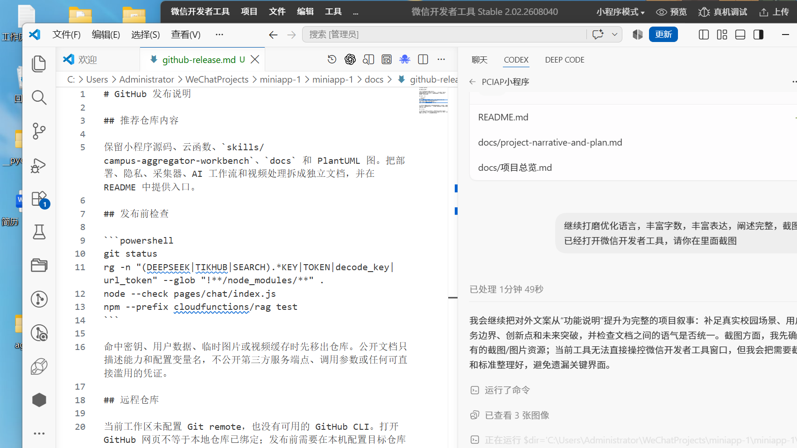

# 界面截图说明

这里保存项目在微信开发者工具中的界面证据。截图的作用是帮助读者理解页面结构和开发阶段的验证过程，不代表线上环境的最终视觉验收结果。

## 当前记录

`devtools-current.png` 记录了本次整理时开发者工具与项目文档同时打开的状态。后续建议在同一窗口比例下补充以下产品界面：

- `01-home.png`：首页资讯和近期事项；
- `02-campus-feed.png`：校园动态与官方资讯分区；
- `03-ai-chat.png`：新建会话、短回答、来源卡片；
- `04-secondhand-book.png`：二手书发布规格；
- `05-admin-center.png`：按业务分组运行采集器；
- `06-login-guide.png`：游客浏览和登录引导。

发布截图前，请关闭调试浮层并遮挡个人账号、云环境标识、内部日志和任何凭证。每张截图最好配一段简短说明，指出它验证的是哪项产品设计，而不是只展示页面外观。

## 已整理的真实页面素材

- [首页](../../images/4ea780dd5bc1b40c8b0a4e71c1acc994.png)
- [校园动态](../../images/29d57afee43e55e25a11bfd9bdcc1c7b.png)
- [AI 助手](../../images/f7230eaa4df803e870f240146356a201.png)
- [管理中心](../../images/ba28f63b5af1cd45b345d8150668a8ee.png)
- [消息](../../images/d887f4ebaef23c57de4483dae25fc94e.png)
- [个人中心](../../images/e2eea86f278becba2efbac177c456586.png)
